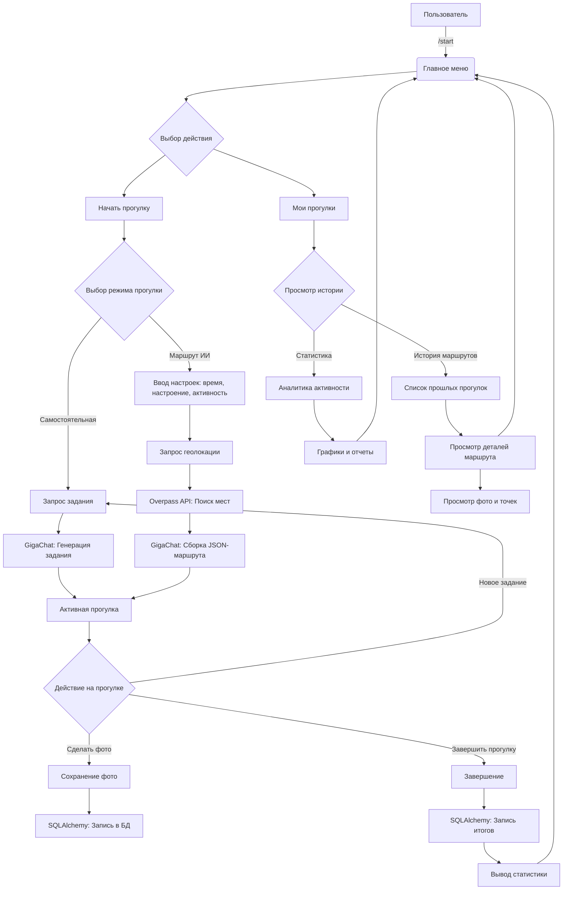

# Документация проекта gotouchthegrassbot

### Режим 1: Самостоятельная прогулка

Пользователь выбирает параметры прогулки (тип активности, настроение, длительность, размер группы). После запуска режима 
бот присылает пользователю задания по заданным параметрам по его требованию. Пользователь может отказаться 
от задания и перегенерировать его

Примеры заданий:

* «Сделай фото чего-то синего рядом»
* «Найди объект круглой формы и сфотографируй»
* «Зайди во двор, который ты никогда не посещал»

### Режим 2: Генерация маршрута

Система формирует **маршрут прогулки** на основе параметров, введенных пользователем (настроение, тип активности, 
длительность прогулки)

Маршрут создаётся на основе **отправной точки пользователя**. 

Пользователь может **перегенерировать маршрут**, если он ему не понравился. 

После генерации маршрута пользователь выполняет задания последовательно, двигаясь по предложенному пути.

## 2. Что будет видеть пользователь

Пользователь взаимодействует с ботом через Telegram. Он увидит:

* Приветственное сообщение
* Меню выбора "начало прогулки", "статистика"
* Далее пользователь выбирает параметры прогулки
* Меню выбора режима: Самостоятельная прогулка или Генерация маршрута
* Для режима 1: возможность запроса задания по требованию и перегенерации его
* Для режима 2: параметры маршрута и возможность перегенерации, затем возможность запроса задания по требованию и затем перегенерации его
* Сгенерированный маршрут прогулки** (точки интереса + порядок посещения, если выбран режим 2)
* Генерируемые задания
* Запрос на отправку фото как подтверждения
* Статистику: Количество прогулок, проведенное в них время, количество выполненных заданий (по требованию)
* Историю выполненных заданий (по требованию пользователя)

## 3. Основные задачи проекта

### 3.1. Анализ требований (2 часа)

* Составить сценарии использования
* Определить параметры генерации заданий и маршрута

### 3.2. Проектирование архитектуры (2 часа)

* Определить взаимодействие модулей и поток данных между режимами

### 3.3. Разработка Telegram-бота (15 часов)

* Настройка Telegram API
* Реализация двух режимов
* Реализация логики генерации заданий и маршрутов
* Обработка фото и сохранение истории

### 3.4. Дополнительные улучшения (при необходимости) (4 часа)

* Система наград
* может быть что-нибудь еще в будущем

### 3.5. Тестирование (4 часа)

* Юнит-тесты
* Проверка корректности сценариев

## 4. Диаграммы системы (Mermaid)

### 4.1. Сценарии использования

### 4.2. Sequence Diagram (пример режима 2)

### 4.3 DataBase

## 5. Команда

### Dev1: Петросян Эдгар

Задачи:
* Регистрация бота
* Генерация заданий и маршрута
* Создание БД и сбор статистики

### Dev2: Хачунский Тимофей
Задачи:
* Создание основы бота (handlers, states)
* Написание тестов
* Создание Докера
